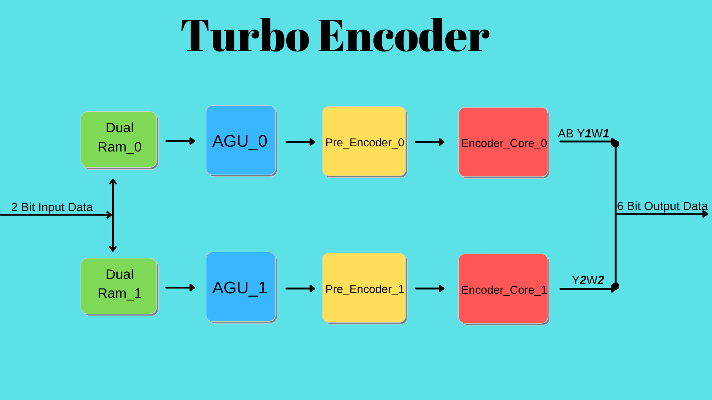
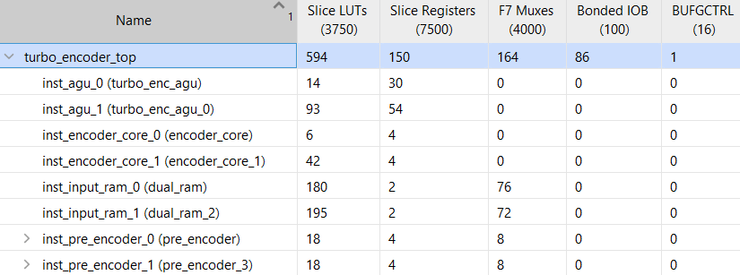
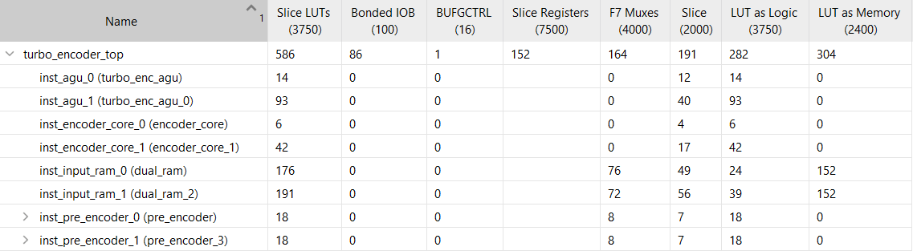

# YONGA-Turbo Encoder

  

Table of contents
=================

- [Overview](#overview)
- [Setup](#setup)
- [Running Simulation](#running-simulation)
- [Hardening the User Project Macro using OpenLANE](#hardening-the-user-project-macro-using-openlane)
- [List of Contributors](#list-of-contributors)

Overview
========

The Turbo Encoder is used for FEC encoding for linear modulation.

Encoder takes 2 bits of input (namely A and B) and generates 6 bits of output in the form (AB Y1W1 Y2W2)

First couple of parity bits (Y1W1) are generated from normal ordered input data while second couple of parity bits (Y2W2) are generated from interleaved input data.

The design involves 2 paths one of which is used for interleaved input data.

#### Top-Level Diagram

-Input Data is stored at dual channel rams. 

-AGU (Address Generator Unit) generates data indices for interleaving.

-Pre Encoder unit identifies initial state of the encoder.

-Encoder Core produces outputs according to the state and the inputs.

#### Synthesis Report

#### Implementation Report

-Reports are based on Xilinx Spartan-7 xc7s6ftgb196-1

#### Throughput

'N' = input data block size in couple number ranging from 56 to 2396.

'f' = frequency in Mhz.

For 50 Mhz clock speed and N = 56, throughput equals 31.5 Mbps.

For 50 Mhz clock speed and N = 2396, throughput equals 33.3 Mbps.

Setup
========

TBA

Running Simulation
========

TBA

Hardening the User Project Macro using OpenLANE
========

TBA

List of Contributors
=================================

*In alphabetical order:*

- Baris Bilgili
- Burak Yakup Cakar
- Muhammed Celik
