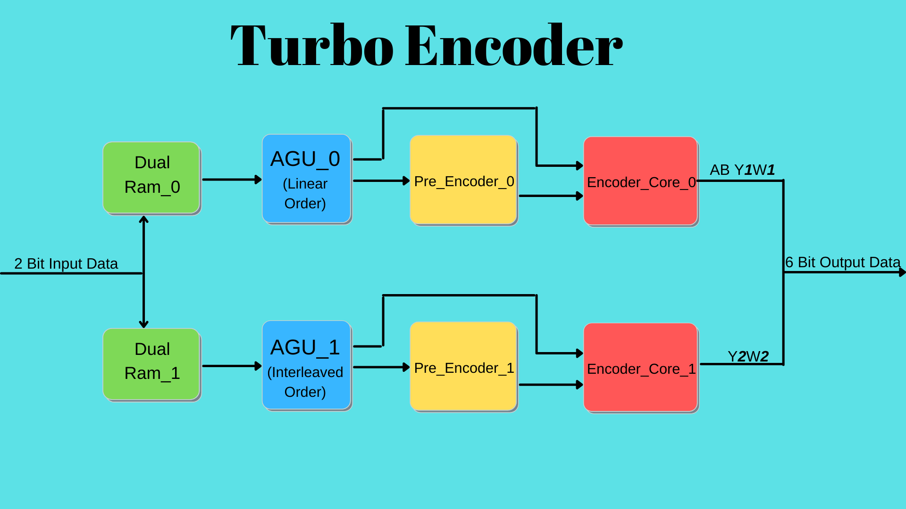

# YONGA-Turbo Encoder

[](https://opensource.org/licenses/Apache-2.0) [](https://github.com/efabless/caravel_project_example/actions/workflows/user_project_ci.yml) [](https://github.com/efabless/caravel_project_example/actions/workflows/caravel_build.yml)

Table of contents
=================

- [Overview](#overview)
- [Setup](#setup)
- [Running Simulation](#running-simulation)
- [Hardening the User Project Macro using OpenLANE](#hardening-the-user-project-macro-using-openlane)
- [List of Contributors](#list-of-contributors)

Overview
========
#### DVB-RCS2 Turbo Encoder

Turbo Encoder is used for FEC encoding for linear modulation.

Encoder takes 2 bits of input (namely A and B) and generates 6 bits of output in the form (AB Y1W1 Y2W2)

First couple of parity bits (Y1W1) are generated from linearly ordered input data while second couple of parity bits (Y2W2) are generated from interleaved input data.

The design involves two paths: 
1) Linear order path
2) Interleaved path

#### Top-Level Diagram


-Input Data is stored at dual channel rams. 

-AGU's (Address Generator Unit) generate data indices for linearly ordered and interleaved data inputs.

-Pre Encoder unit identifies initial state of the encoder.

-Encoder Core produces outputs according to the state and the inputs.

#### Synthesis Report


#### Implementation Report


-Reports are based on Xilinx Spartan-7 xc7s6ftgb196-1


#### Throughput


'N' = input data block size in couple number ranging from 56 to 2396.

'f' = frequency in Mhz.

For 50 Mhz clock speed and N = 56, throughput equals to 31.5 Mbps.

For 50 Mhz clock speed and N = 2396, throughput equals to 33.3 Mbps.

Setup
========
To setup caravel, run the following
```
git clone https://github.com/yongatek/caravel_yonga-turbo-encoder.git
cd caravel_yonga-turbo-encoder
make install
```
Setup the pdk
```
export PDK_ROOT=<pdk-installation-path>
make pdk
```

Running Simulation
========
First, you will need to install the simulation environment, by
```
make simenv
```
Then set the environment properly
```
export PDK_ROOT=<pdk-installation-path>
export CARAVEL_ROOT=$(pwd)/caravel
```
Specify simulation mode
```
export SIM=RTL
# use the command below for GL simulation
# export SIM=GL
```
Run these commands to test YONGA-Turbo Encoder
```
# run Turbo Encoder WB test
make verify-turbo_encoder_wb_test
# run Turbo Encoder GPIO test
make verify-turbo_encoder_gpio_test
```

Hardening the User Project Macro using OpenLANE
========
First, you will need to install openlane to harden the user project macro
```
export OPENLANE_ROOT=<openlane-installation-path>
make openlane
```
To harden the user project macro run the following
```
# Run openlane to harden user_proj_example
make user_proj_example
# Run openlane to harden user_project_wrapper
make user_project_wrapper
```
List of Contributors
=================================

*In alphabetical order:*

- Baris Bilgili
- Burak Yakup Cakar
- Muhammed Celik
